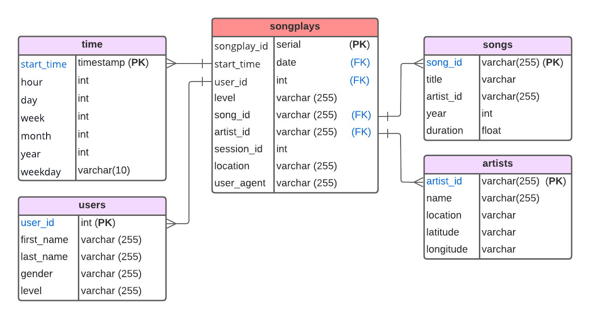

<!--

natalianrs/natalianrs is a ✨ special ✨ repository because its `README.md` (this file) appears on your GitHub profile.
You can click the Preview link to take a look at your changes.
--->

<h2> Hello! ✌</h2>

###

- 👋 Hi, I’m Natália
- 👀 I’m interested in ...
- 🌱 I’m currently learning ...
- 💞️ I’m looking to collaborate on ...
- 📫 How to reach me ...

<p align="left">
<a href="https://github.com/natalianrs">
  
</a>
</p>

# Data Modeling with Postgres
## Introduction

A startup called Sparkify wants to analyze the data they've been collecting on songs and user activity on their new music streaming app. The analytics team is particularly interested in understanding what songs users are listening to. Currently, they don't have an easy way to query their data, which resides in a directory of JSON logs on user activity on the app, as well as a directory with JSON metadata on the songs in their app.

This project aims to create ETL pipeline for loading song and user data into postgres database.
The resulting database is used by analytics team to query and analyze the data.

## Datasets

### song dataset
- Files are nested in subdirectories under data/song_data.
- Each file is in JSON format and contains metadata about a song and the artist of that song. 
- For example, here are filepaths to two files in this dataset

```
    song_data/A/B/C/TRABCEI128F424C983.json
    song_data/A/A/B/TRAABJL12903CDCF1A.json
```
And below is an example of what a single song file, TRAABJL12903CDCF1A.json, looks like.

```
{"num_songs": 1, "artist_id": "ARJIE2Y1187B994AB7", "artist_latitude": null, "artist_longitude": null, "artist_location": "", "artist_name": "Line Renaud", "song_id": "SOUPIRU12A6D4FA1E1", "title": "Der Kleine Dompfaff", "duration": 152.92036, "year": 0}
```


### log dataset
- Files are nested in subdirectories under data/log_data.
- Each file is in JSON format and contains metadata about a song and the artist of that song. 
- For example, here are filepaths to two files in this dataset

```
    log_data/2018/11/2018-11-12-events.json
    log_data/2018/11/2018-11-13-events.json
```

And below is an example of what the data in a log file, 2018-11-12-events.json, looks like.


```
{"artist":"Slipknot","auth":"Logged In","firstName":"Aiden","gender":"M","itemInSession":0,"lastName":"Ramirez","length":192.57424,"level":"paid","location":"New York-Newark-Jersey City, NY-NJ-PA","method":"PUT","page":"NextSong","registration":1540283578796.0,"sessionId":19,"song":"Opium Of The People (Album Version)","status":200,"ts":1541639510796,"userAgent":"\"Mozilla\/5.0 (Windows NT 6.1) AppleWebKit\/537.36 (KHTML, like Gecko) Chrome\/36.0.1985.143 Safari\/537.36\"","userId":"20"}
```

## Database schema
- Star schema is used for this project.
- Schema consists of one fact table (songplays) which contains all the measures associated with users event and 
four dimension tables(users,songs,artists,time) to further describe dimension details 
- Each dimension table have primary key index which is referenced from the fact table(songplays)

### Star schema model diagram :




## Prerequisits 
This project requires 
- Python3
- psycopg2 and pandas packages
- PostgreSQL database on localhost

## Files description

- create_tables.py : it contains all DDL and DML for the required data model implementation
- sql_queries: it contains all DDL and DML queries
- etl.ipynb : it reads and processes a single file from song_data and log_data and loads the data into your tables. This notebook contains detailed instructions on the ETL process for each of the tables.
- etl.py : it contains the code for ETL pipeline for all data files
- test.py: it contains the code to validate ETL flow(ie.displays the first few rows of each table to let you check your database)
- test.ipynb : its functionality is same as test.py but implemenation is with the help of ipython-sql mode.
- sparkify_schema_model.png : data model schema diagram


## Running the module
At the terminal
- to drop existing and create new database with designed Fact and Dimension tables
```
python create_tables.py
```
- for etl flow
```
python etl.py
```
- fetch each table heads(ie.fetch first few records to validate previous two steps)
```
python test.py
``` 

